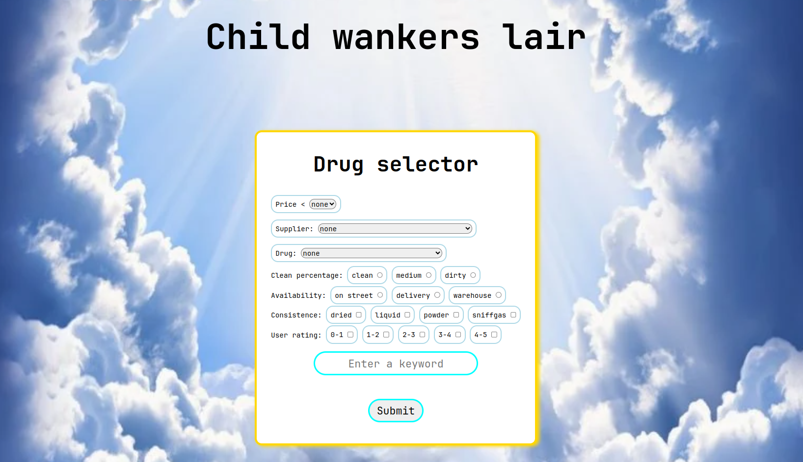
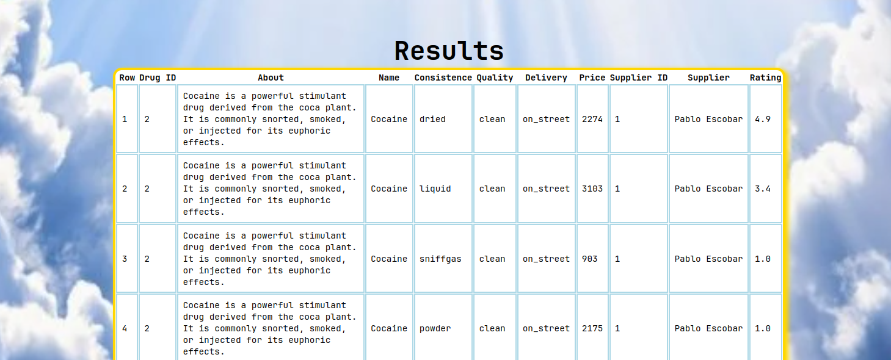
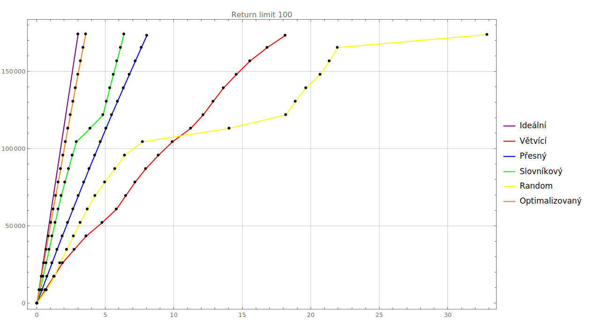
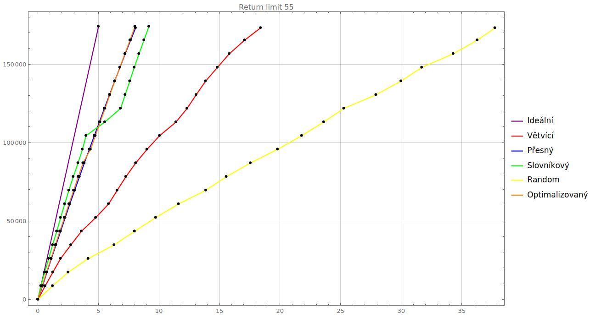
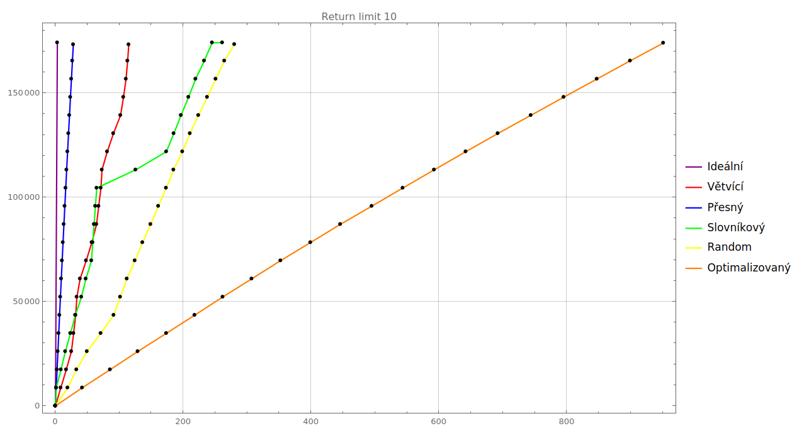

# Deep web

Autoři: Matěj Formánek, Janis Berberi

## 1) Zadání

Velká část informací na internetu není jednoduše dostupná s využitím běžného vyhledávače. Pokud se jedná o
legální obsah, který není vyhledávačem běžně indexovaný, označujeme tuto část webu jako deep web. Jednou
z variant deep webu jsou i informace v databázi, ke kterým se lze dostat pouze s využitím webového formuláře.
V rámci projektu je potřeba nejprve navrhnout a implementovat aplikaci, která bude simulovat stránky, ze
kterých budeme snažit získat data.

## 2) Implementace

### 2.1) Prostředí

Celá aplikace běží na školním cloudu (Openstack) v Alpine distribuci.

### 2.2) Web

Běží na Apache serveru. Je napsán v PHP s CSS a JS GUI prvky. Obsahuje formulář a REST API pro komunikaci s databází za
pomoci pgsql PHP knihovny.

### 2.3) Databáze

Běží na stejném serveru a je v PostgreSQL. Máme k dispozici 2 sety dat a to malý (14 516 řádek) a střední (174 192
řádek) celý výzkum je provázen na středním data setu.

### 2.4) Crawler

Rovněž napsán v PHP/Symphony. Umí komunikovat s databází, aby vracela chtěný počet řádek a rovněž umí nasazovat chtěný
datový set.
Dále načítá přes web Api data z databáze a ukládá je do svojí tabulky v databázi.

### 2.5) Nasazení

Na serveru stáhnout apache a postgres.
Do apache zkopírovat složko Web.
Databázi nasadí crawler.

Pro inicializaci crawlera:
``composer install``
stáhne knihovny.
Může po vás chtít povolit či doinstalovat knihovny "pgsql" a "pcntl" -> (dostupné pouze na UNIX).

Pro spuštění s hodnotami nastavenými ve složce: ``composer start`` nebo ``php crawler.php``. Navíc je možné spustit s
přesně 2 argumenty kde první udává "return limit" a druhý "filler type" viz ``php crawler.php 100 2``.

## 3) Výzkum

Podíváme se zde na to, jak různé přístupy pro crawlovani dat v podobě metod průchodu a výběru prvků formuláře, ovlivňují
efektivitu s rychlostí nalezení co nejvíce dat. Budeme zde sledovat 5 různých průchodů formulářem s různě velkými
návratovými hodnotami našeho webu. Tyto průchody budeme sledovat, jak finálním výsledkem, tak rovněž postupnými daty,
které vykreslíme do grafu pro lepší vizualizaci.

### 3.1) Formulář

Tematicky jsme k deep webu zvolili databázi drog a jejich dodavatelů. Pomocí Javascriptu jsme i nastavili, že si
pamatuje poslední zadaný dotaz, takže nemusíte vždy znovu zadávat celý formulář.

Obsahuje:

* 3 Dropdown menu (Cena, Jméno dodavatele, Jméno drogy)
* 2 Radio button výběry (Čistota, Dostupnost)
* 2 Checkbox výběry (Konzistence, Uživatelské hodnocení)
* 1 Textbox

#### 3.1.1) Cena

Dropdown s rozsahem 0 - 5000. Formulář defaultně vrací data seřazena od nejdražší po nejlevnější. To má za příčinu, že
při průchodu podle ceny nám hrozí velká redundance, způsobena volbou špatného kroku či nerovnoměrné rozmístění cen.

#### 3.1.2) Jméno dodavatele

Dropdown se 76 jmény dodavatelů. Velmi silný atribut, který minimalizuje redundanci. Při pouhém zvolení jednoho
dodavatele vrací 2292 / 174192 řádek.

#### 3.1.3) Jméno drogy

Dropdown se 191 jmény drog. Velmi silný atribut, který minimalizuje redundanci, avšak je ho výrazně více než dodavatelů.
Za to při pouhém zvolení jedné drogy vrací 912 / 174192 řádek.

#### 3.1.4) Čistota

Radio button výběr ze 3 možností: čistá, středně čistá, špinavá(řízlá). Každá droga je prodávaná ve všech třech
čistotách. Velmi dobré na upřesnění výsledku.

#### 3.1.5) Dostupnost

Radio button výběr ze 3 možností: Na ulici, Dovoz, Na skladě. Rovněž velmi dobré na upřesnění výsledku.

#### 3.1.6) Konzistence

Checkbox výběr z kombinace 4 možností: sušená, kapalná, prášek, čichací plyn. Dohromady s Čistotou a Jménem drogy +
dodavatele tvoří "primární klíč" => 4 * 3 * 191 * 76 = 174 192 unikátních záznamů.

#### 3.1.7) Uživatelské hodnocení

Checkbox výběr z hodnocení od 0 do 5. Náhodné rozmístění výsledků může hrát roli obzvlášť v krajních bodech spektra.

#### 3.1.8) Textbox

Textbox který filtruje všechny sloupce tabulek a snaží se najít shodu. Dobrý pro [slovníkový útok](#323-slovníkový).

### 3.2) Průchody formulářem

Začínáme v kořeni stromu (prázdný formulář) naším cílem je co nejrychleji a nejlépe odhalit celou databázi. Budeme u
všech průchodu využívat Top-k algoritmus, který jemně shrneme níže. Důležité pojmy jsou:

* Return limit - Počet prvků, které web maximálně vrací
* Underflow - Hodnota menší než "Return limit"
* Overflow - Hodnota větší rovna než "Return limit"

1) Zde začínáme vyplňovat první prvek formuláře
2) Pokud dostaneme "overflow", tak pokračujeme hlouběji doplňováním dalších prvků formuláře
3) Pokud dostaneme "underflow", tak se už nezanořujeme a zkoušíme ostatní prvky aktuálního prvku či při dokončení všech se
   vynořujeme zpět.

Tím dosáhneme toho, že se vyhneme zbytečnému zanořování a čtení redundantních dat. Níže budeme zkoumat v jakém pořadí
vyplňovat prvky pro dosažení Nejvyšší efektivity, rychlosti či redundance závisející na "return limitu".

#### 3.2.1) Větvící

První průchod nazýváme větvící z důvodu, že prochází prvky v pořadí, kde horní prvky co nejméně zužují počet vrácených
řad. To zapříčiňuje husté větvení, které je rozhodováno silnými drop downy na konci.

Průchod:

1) Dropdown - Price
2) Radio - Quality
3) Radio - Availability
4) Checkbox - Consistence
5) Checkbox - Rating
6) Dropdown - Drug
7) Dropdown - Supplier
8) Textbox

Případné zlepšení by bylo vyměnit 8 a 6 kvůli tomu, že z pravidla na 6 se zastaví větvení a bude muset projet velké
množství unikátních jmen drog namísto dobře zvolených slov ve slovníku.

#### 3.2.2) Přesný

Začíná 2 drop downy kde rovnou určí dodavatele i drogu. To vede na malé větvení s malou redundancí. Avšak za cenu malých
returnů => hodně crawlů. Už po prvních 2 drop downech nám to vrátí pouze 12 řad, ale vždy budeme muset projet minimálně
191 * 76 = 14 516.

1) Dropdown - Supplier
2) Dropdown - Drug
3) Radio - Quality
4) Radio - Availability
5) Checkbox - Consistence
6) Checkbox - Rating
7) Dropdown - Price
8) Textbox

#### 3.2.3) Slovníkový

Začíná vyplňováním klíčových slov v textboxu (slovníkový útok). Klíčová slova nemusí vždy stačit na nalezení velké části
databáze. Zároveň může hrozit velká redundance kvůli průniku položek s klíčovými slovy [viz graf 4.3.1](#431-graf).

1) Textbox
2) Dropdown - Supplier
3) Radio - Quality
4) Radio - Availability
5) Checkbox - Consistence
6) Checkbox - Rating
7) Dropdown - Price
8) Dropdown - Drug

#### 3.2.4) Random

V každém kroku, kdy se zanořuje zcela náhodně vybere prvek formuláře, který v aktuální cestě stromem ještě nevyplňuje.
Pokud se vynoří a znova zanoří bude se zanořovat opět do randomizovaného prvku.

1-8 ???

#### 3.2.5) Optimalizovaný

Podobný [3.2.3](#323-slovníkový)) Přesný, ale místo druhého dropdownu jsou hned 2 Radia. Díky tomu pro 1 Drop down a 2 Radia už vrací
zpravidla méně než 100 prvků. Díky tomu pro velké Return limity se bude blížit "Ideálnímu" crawleru, avšak uvidíme níže,
že pro malý Return se efekt může dost obracet [viz graf 4.3.1](#431-graf).

1) Dropdown - Supplier
2) Radio - Quality
3) Radio - Availability
4) Checkbox - Consistence
5) Checkbox - Rating
6) Dropdown - Price
7) Dropdown - Drug
8) Textbox

Opět jako u [3.2.1](#321-větvící) Větvící, by bylo možné lehčí zlepšení prohodit 6 a 8.

## 4) Výsledky

Následující kapitola bude rozebírat výsledky výše zmíněných 5 průchodů obohacených o grafy a případná zlepšení. Každá
tečka v grafu reprezentuje nově přečtených 5% celé databáze. Výsledky
bude sledovat v závislosti na Return limitu a bude nás zajímat, jak si vedl časově a jak efektivně hledal nové řady.

Důležité zmínit, že rychlost všech testů může v praxi dost záležet na vytížení serveru a rychlosti připojení na obou
stranách. Ve snaze o co nejpřesnější výsledky, všechny testy byly provedeny ve stejném prostředí na školním cloudu a to
navíc 3 krát abychom se vyvarovali náhodných úletů.

### 4.1) Return limit 100

Začneme od největšího testovaného limitu, který umožňuje velmi rychlé a jak si ukážeme i dobře optimalizované řešení. Na
grafu je vždy všech 5 průchodů plus fialově "Ideální" možný (1742).

#### 4.1.1) Graf

#### 4.1.2) Statistiky

#### Ideální

Imaginární koncept perfektního průchodu. Bohužel jednoduchým průchodem pomocí stromu jej nelze ani dosáhnout, avšak
snažíme se mu co nejvíce přiblížit.

* Running time: 3 minutes.
* Return limit: 100
* Database discovered 100% ( 174192 / 174192 )
* Read: 174192 lines.
* Saved: 174192 lines.
* Redundant lines read: 0 ( 0% )
* Crawled: 1742 times.
* Average crawled: 100 lines.
* Unique lines crawled: 100 lines.

  

  

#### Větvící

Hlavní neduhou je samotná vlastnost mnoha větvení, protože každé zanoření nás stojí čas, kdy musíme posílat request na
web. Rovněž má malý lines crawled, protože až na konci v listu přidáváme většinu dat a trávíme zde nejvíce času. Zde
však množství crawlů přemůže to, že jsou malé => pomalé.

* Running time: 18.12 minutes.
* Return limit: 100
* Database discovered 99.52% ( 173348 / 174192 )
* Read: 210388 lines.
* Saved: 173348 lines.
* Redundant lines read: 37040 ( 17.61% )
* Crawled: 34611 times.
* Average crawled: 6.08 lines.
* Unique lines crawled: 5.01 lines.

  

  

#### Přesný

Velmi efektivní, redundantní řady jsou téměř zanedbatelné za cenu většího množství crawlů. Malé crawly mají ale
výhodu v tom, že jsou velmi rychlé, co se týče komunikace s webem. Plus díky téměř identickým requestům do databáze, je
má již připravené a vrací je velmi rychle.

* Running time: 8.02 minutes.
* Return limit: 100
* Database discovered 99.5% ( 173316 / 174192 )
* Read: 181080 lines.
* Saved: 173316 lines.
* Redundant lines read: 7764 ( 4.29% )
* Crawled: 14594 times.
* Average crawled: 12.41 lines.
* Unique lines crawled: 11.88 lines.

  

  

#### Slovníkový

Velmi dobrý způsob ale jak bylo psáno již ve [3.2.3](#323-slovníkový) hrozí, že některá slova budou redundatní. Jak zde vidíme, v 60% - 70%
ztratíme mnoho času při redundatních slovech. Oproti předchozím 2 vidíme, že s velkým Return limitem je výhodnější
větší průměrné crawly s tím, že jich ale mají méně.

* Running time: 6.35 minutes.
* Return limit: 100
* Database discovered 100% ( 174192 / 174192 )
* Read: 489168 lines.
* Saved: 174192 lines.
* Redundant lines read: 314976 ( 64.39% )
* Crawled: 8307 times.
* Average crawled: 58.89 lines.
* Unique lines crawled: 20.97 lines.

  

  

#### Random

Prvních 60% zvládne velmi obstojně, avšak čím preciznější data hledáme tím je náhoda slabá a jak vidíme skoro
70% řad které načteme jsou zcela zbytečné.

* Running time: 32.85 minutes.
* Return limit: 100
* Database discovered 99.81% ( 173856 / 174192 )
* Read: 527821 lines.
* Saved: 173856 lines.
* Redundant lines read: 353965 ( 67.06% )
* Crawled: 61822 times.
* Average crawled: 8.54 lines.
* Unique lines crawled: 2.81 lines.

  

  

#### Optimalizovaný

Skoro identické s Ideálním řešením, pouze o 2058 crawlu více. Spočívá to v tom, že začínáme dodavatelem, který nám ostře
zmenší vrácená data a poté následující dvě Radia v průměru zmenší data již na Average 73.

* Running time: 3.56 minutes.
* Return limit: 100
* Database discovered 100% ( 174192 / 174192 )
* Read: 274708 lines.
* Saved: 174192 lines.
* Redundant lines read: 100516 ( 36.59% )
* Crawled: 3800 times.
* Average crawled: 72.29 lines.
* Unique lines crawled: 45.84 lines.

  

#### 4.1.3) Shrnutí

Při velkém return limitu se vyplatí menší množství crawlu s tím, že průměrný počet řad je velký. Dokonce v tomto
případě i velké množství redundantních řad je "irelevantní". Přednostně nejlepší je zde velký unique lines crawled, jako
druhý malé množství crawlů. Proto nejlepší 2 jsou Optimalizovaný a Slovníkový průchod, protože oba jsou velmi mělké a
poskytují velký average crawle.

### 4.2) Return limit 55

Snížíme limit o 45 (poté budeme ještě jednou o 45). Zapříčiní to především zpomalení kvůli vyššímu počtu crawlů. Na
grafu je vždy všech 5 průchodů plus fialově "Ideální" možný (3168).

#### 4.2.1) Graf

#### 4.2.2) Statistiky

#### Ideální

Imaginární koncept perfektního průchodu. Bohužel jednoduchým průchodem pomocí stromu jej nelze ani dosáhnout, avšak
snažíme se mu co nejvíce přiblížit.

* Running time: 6 minutes.
* Return limit: 55
* Database discovered 100% ( 174192 / 174192 )
* Read: 174192 lines.
* Saved: 174192 lines.
* Redundant lines read: 0 ( 0% )
* Crawled: 3168 times.
* Average crawled: 55 lines.
* Unique lines crawled: 55 lines.

  

  

#### Větvící

Jak již bylo řečeno výše větvící rozhoduje až v kořenech listů, na průměru 6 řad proto ani zmenšení na 55 v podstatě
nezmění jeho průběh.

* Running time: 18.38 minutes.
* Return limit: 55
* Database discovered 99.5% ( 173315 / 174192 )
* Read: 199993 lines.
* Saved: 173315 lines.
* Redundant lines read: 26678 ( 13.34% )
* Crawled: 34611 times.
* Average crawled: 5.78 lines.
* Unique lines crawled: 5.01 lines.

  

  

#### Přesný

Snížení Return limitu nijak neovlivňuje samotný průchod, ale díky malým a přesným crawlům je stále velmi rychlé, mezitím
co ostatní průchody značně zpomalují. Tak se dostává na úroveň Optimalizovaného řešení.

* Running time: 8.06 minutes.
* Return limit: 55
* Database discovered 99.49% ( 173299 / 174192 )
* Read: 177570 lines.
* Saved: 173299 lines.
* Redundant lines read: 4271 ( 2.41% )
* Crawled: 14594 times.
* Average crawled: 12.17 lines.
* Unique lines crawled: 11.87 lines.

  

  

#### Slovníkový

Average počet řad u return limitu 100 byl 58 proto není překvapením, že výsledek zde je skoro ekvivalentním.

* Running time: 9.16 minutes.
* Return limit: 55
* Database discovered 100% ( 174192 / 174192 )
* Read: 464703 lines.
* Saved: 174192 lines.
* Redundant lines read: 290511 ( 62.52% )
* Crawled: 13835 times.
* Average crawled: 33.59 lines.
* Unique lines crawled: 12.59 lines.

  

  

#### Random

Kvůli menšímu Returnu nám zmizel už skok a dostáváme rovnoměrný velmi slabý přírůst. Zde je třeba brát vše s
nadsázkou, přeci jen se stále jedná o zcela Random průchod.

* Running time: 37.72 minutes.
* Return limit: 55
* Database discovered 99.47% ( 173272 / 174192 )
* Read: 455603 lines.
* Saved: 173272 lines.
* Redundant lines read: 282331 ( 61.97% )
* Crawled: 76678 times.
* Average crawled: 5.94 lines.
* Unique lines crawled: 2.26 lines.

  

  

#### Optimalizovaný

Optimalizovaný měl předchozí průměr řad 73, proto se zde lehce zpomalí, když bude ještě navíc přetékat do jednoho
checkboxu. I tak se stále po Ideálním se jedná o nejlepší průchod. Počet crawlů se zvětšil z 2x na 4x víc.

* Running time: 8.01 minutes.
* Return limit: 55
* Database discovered 100% ( 174192 / 174192 )
* Read: 335869 lines.
* Saved: 174192 lines.
* Redundant lines read: 161677 ( 48.14% )
* Crawled: 12515 times.
* Average crawled: 26.84 lines.
* Unique lines crawled: 13.92 lines.

  

#### 4.2.3) Shrnutí

Jedná se vlastně o velmi podobný graf jako [#4.1.1](#411-graf). Velká změna je pouze v tom, že menší Return zapříčiní zvýšení času a
množství crawlů, až na průchodů Větvící a Přesný, které díky malým average crawlům jsou netčeny. Zatímco ostatní slábnou,
což to o to víc uvidíme ještě v grafu níže.

### 4.3) Return limit 10

Snížíme limit znova o 45. Jak uvidíme obrátí to vše úplně naruby. Priority, které byly žádané výše, jsou nyní slabinami. Na
grafu je vždy všech 5 průchodů plus fialově "Ideální" možný (17420).

#### 4.3.1) Graf

#### 4.3.2) Statistiky

#### Ideální

Imaginární koncept perfektního průchodu. Bohužel jednoduchým průchodem pomocí stromu jej nelze ani dosáhnout,
snažíme se mu ale co nejvíce přiblížit.

* Running time: 20 minutes.
* Return limit: 10
* Database discovered 100% ( 174192 / 174192 )
* Read: 174192 lines.
* Saved: 174192 lines.
* Redundant lines read: 0 ( 0% )
* Crawled: 17420 times.
* Average crawled: 10 lines.
* Unique lines crawled: 10 lines.

  

  

#### Větvící

Konečně se začíná projevovat jeho síla v malých rozvětvených requestech. Dostává se s přehledem na druhé místo. Při
zmenšení Return limitu by se ukázal jako ještě silnější průchod.

* Running time: 114.7 minutes.
* Return limit: 10
* Database discovered 99.47% ( 173268 / 174192 )
* Read: 216618 lines.
* Saved: 173268 lines.
* Redundant lines read: 43350 ( 20.01% )
* Crawled: 239963 times.
* Average crawled: 0.9 lines.
* Unique lines crawled: 0.72 lines.

  

  

#### Přesný

Přebírá roli Optimalizovaného řešení. Díky stále malým crawlům nyní maximálně začne přesahovat do prvního checkboxu, což
vidíme i přímo úměrně na 4x zvětšení času za průchod vždy celého checkboxu. A stejně jako v minulém případu mělo
Optimalizované řešení 4x více crawlů, tak tady má toto řešení rovněž 4x více. Pro Return limit 13 bychom touto metodou
dostali defacto Ideální řešení.

* Running time: 27.98 minutes.
* Return limit: 10
* Database discovered 99.48% ( 173280 / 174192 )
* Read: 318460 lines.
* Saved: 173280 lines.
* Redundant lines read: 145180 ( 45.59% )
* Crawled: 57914 times.
* Average crawled: 5.5 lines.
* Unique lines crawled: 2.99 lines.

  

  

#### Slovníkový

Si stále udržuje zlatou střední cestu, avšak zlomí mu vaz na konci dobře viditelně to, že posledních pár dat mu trvalo
dlouho, než zvládl nalézt. Stále zde vidíme propad redundantních slov a kvůli mnoha crawlům už i časově zaostává (2x více
crawlů než větvící).

* Running time: 261.1 minutes.
* Return limit: 10
* Database discovered 100% ( 174191 / 174192 )
* Read: 650847 lines.
* Saved: 174191 lines.
* Redundant lines read: 476656 ( 73.24% )
* Crawled: 534682 times.
* Average crawled: 1.22 lines.
* Unique lines crawled: 0.33 lines.

  

  

#### Random

Překvapivě zdárný výsledek. Nejedná se zrovna jeden dobrý běh, ale skutečně ve všech 3 testech dopadl v rozmezí 300
minut. Překvapivé to není tolik, protože kvůli požadavku na malý Return se velmi větví a tím se i zmenšuje
počet redundantních randomizací.

* Running time: 280.06 minutes.
* Return limit: 10
* Database discovered 99.52% ( 173362 / 174192 )
* Read: 423952 lines.
* Saved: 173362 lines.
* Redundant lines read: 250590 ( 59.11% )
* Crawled: 611837 times.
* Average crawled: 0.69 lines.
* Unique lines crawled: 0.28 lines.

  

  

#### Optimalizovaný

Největší propad a vlastně zcela nepoužitelný průchod. Je to dáno tím, že nabere velké množství informací, ale kvůli
neustálému zanořování se dostane do drop downů s Cenou a Jménem drogy, kde po většinu času bude dostávat 0 řad. Jak bylo
zmíněno výše jemným zlepšením by bylo využití textboxu, ale stále vidíme, že tato metoda je nepoužitelná.

* Running time: 950.93 minutes.
* Return limit: 10
* Database discovered 99.91% ( 174040 / 174192 )
* Read: 436284 lines.
* Saved: 174040 lines.
* Redundant lines read: 262244 ( 60.11% )
* Crawled: 2048767 times.
* Average crawled: 0.21 lines.
* Unique lines crawled: 0.08 lines.

  

#### 4.3.3) Shrnutí

Kromě stále skvěle pracujícího Přesného průchodu se nám graf naprosto převrátil. Průchody poskytující data v rozmezí
kolem 50-100 po málo zanořeních absolutně pohoří při hlubším ponoření. Za to Větvící konečně ukazuje své uplatnění v
mnoha přesných malých requestech v listech. Optimalizované je nyní zcela nepoužitelné a Slovníkové, kvůli redundanci a
problému najít finální data, se dostává z možnosti být dobrý průchod na téměř ekvivalentní Random průchodu.

## 5) Pozorování

Jednotlivé zhodnocení a přehled kladů/záporů každého průchodu.

### 5.1) Větvící

Klady:

* Malá redundance dat.
* Při malých returnech roste efektivita.

Zápory:

* I při větším returnu mnoho crawlů => pomalé.
* Není stabilní (graf je zvlněná přímka).

Vhodné pro menší returny ale velký počet crawlů bohužel zapříčiňuje, že pro velký return je pomalá, a i s klesajícím
returnem je rychlost stále spíše středně rychlá, kvůli množství práce, kterou musí odvést. Relativně dobrá pro return
limit v rozsahu 10 - 20. V celkovém hodnocení bych tento průchod umístil na 4. místo.

### 5.2) Přesný

Klady:

* Malý average crawle => rychlá komunikace s webem + silný pro malé returny.
* Prakticky nulová redundance.
* Stabilní graf

Zápory:

* Malý average crawle => pro velké returny začne růst čas a počet crawlů.

Pro námi sledovaný rozsah returnů jednoznačně nejúspěšnější a nejlepší průchod (1. místo). Má minimální redundanci a
díky malým crawlům i rychlou komunikaci s webem. Avšak je důležité udržet na paměti, že pokud bychom sledovali vyšší
returny tak jeho účinnost a rychlost bude klesat, podobně jako Optimalizovaný je čím dál horší při klesajících
returnech.

### 5.3) Slovníkový

Klady:

* Velké returny => rychlé při větších returnech.
* Průměrně rychlé pro malé returny.

Zápory:

* Velká redundance dat.
* Není stabilní => redundantní slova.
* Mohou nám chybět klíčová slova na nalezení celé databáze.
* Čím více dat máme načteno tím více upadá rychlost a přesnost hledání.

Potenciálně nejsinější průchod, jehož však neustále zmiňované zápory ho přesouvají na lepší střed. Velkou roli hraje
return limit, kde čím větší tím méně se projevují, ale jak jsme viděli u 10 jsme již na úrovni Random. Slova jsme zde
při testech načítali náhodně abychom ukázali naši jistou neznalost, ale při správném "Ideálním" uspořádání jsme byli
schopni dosáhnout rovněž stabilního grafu (přímka). Proto jsme daný průchod zařadili na 2. místo.

### 5.4) Random

Klady:

* Je zde vždy šance, že proběhne jako Ideální průchod.

Zápory:

* Nepraktické, pomalé, nemusí nikdy doběhnout.

Vlastně velmi milé překvapení, samozřejmě výsledky jsou z pravidla nejhorší a rozhodně se umístil na 5. příčku, ale ve
všech testech byl schopen načíst defacto celou databázi a v posledním testu se skoro rovná Slovníkovému průchodu. Těžko
samozřejmě více hodnotit zcela randomizovaný průchod, ale alespoň nám ukazuje, že má smysl hledat lepší než prostoduché
řešení.

### 5.5) Optimalizovaný

Klady:

* Rychlé mělké zanoření vrací 50-100 řad => skvělé pro velký return.
* Téměř identické Ideálnímu řešení pro return limit 100.
* Pro velké returny malý počet crawlů.

Zápory:

* Se zmenšujícím se return limitem rapidně zpomaluje => až je zcela nepoužitelný.
* Vysoká redundance.
* Špatné větvení.

Jak bylo řečeno v 5.2) Přesný tyto dva průchody jsou si vzájemně vlastně inverzí, co se týče average crawlů a
vyhovujících return limitů. Jak vidíme pro 100 můžeme považovat za skoro "Ideální řešení", pro 55 si je ekvivalentní s
5.2 a pro 10 je již nepoužitelný. Nakonec ho hodnotíme jako 2. nejlepší způsob průchodu i když je to lehce sporné kvůli
poslednímu testu.

## 6) Celkové shrnutí

Všechny průchody mají své silné a slabé stránky, které zde byly otestovány. Nejlépe z nich vzešel [5.2](#52-přesný) který díky malé
redundanci a rychlým crawlům zvládl být velmi rychlý, efektivní a v testech 55,10 se nejvíce přibližoval "Ideálnímu"
řešení. Proto rozhodně pokud bychom nevěděli, jaký bude return či se vždy střídal je toto nejlepším řešením. Pokud bychom
chtěli co nejlepší řešení pro náhodnou databázi náš postup by měl v prvním kroku zjistit return limit, následně pro 55 >
return využít [5.2](#52-přesný) a v opačném případě [5.5](#55-optimalizovaný).

Průchod [5.3](#53-slovníkový), pokud operujeme s daty, které nám jsou blízké a jsme schopni navolit vhodná slova, má potenciál na to být
rozhodně rovněž nejlepší volbou. Samozřejmě najít tento ideální slovník je mnohdy nemožné, a proto je to spíše středně
vhodná možnost.

Průchod [5.1](#51-větvící) nalezne dobré využití pouze u malého returnu, ale i zde je stále [5.2](#52-přesný) účinnější, proto je tento průchod pro nás
vlastně zcela neatraktivní.

Z toho plyne pozorování, že bez ideálního slovníku nejsme schopni najít jeden průchod, který by byl efektivní, když return
roste i klesá. Vypozorovali jsme zde 2 způsoby, jak velmi efektivně procházet data s velkým i malým returnem a při
dolování tedy chceme použít daný způsob dle return limitu.

Dobré rovněž poznamenat, že oba [5.2](#52-přesný) a [5.5](#55-optimalizovaný) začínají silným drop downem, což je důležitý fakt, protože při naší velikosti
databáze, a jak jsme si již řekli, nechceme velké větvení, nám tento atribut rovnou silně zmenší počet vrácených dat. Poté
už, pokud máme malý return, pokračuje stejnou myšlenkou a chceme další drop down [5.2](#52-přesný) a vice versa [5.5](#55-optimalizovaný).

## 7) Závěr

Ukázali jsme si zde, jak lze simulovat prohledávání deep webu. Vysvětlili jsme, jak lze daný projekt nasadit a spustit pro lokální testování. Především jsme však nastínili, jak různé průchody formulářem s pomocí algoritmu Top-k dokáží
vydolovat databázi z webu. Zjistili jsme, že nelze jednoduše vytvořit jeden způsob průchodu, který by byl schopen
pracovat efektivně, jak pro malé, tak pro velké return limity. Důležité je si odnést, že chceme, aby naše průchody byly
mělké a v ideálním případě co nejblíže return limitu.
